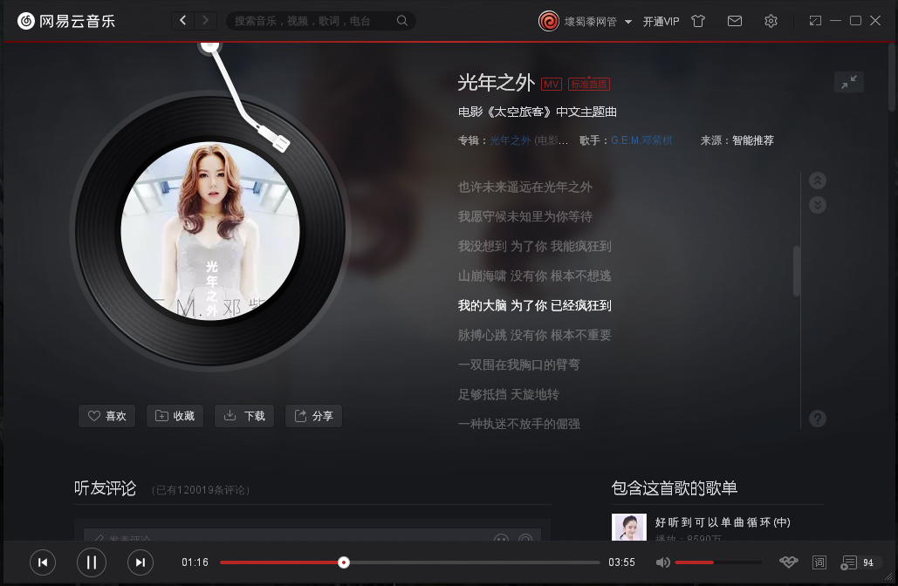
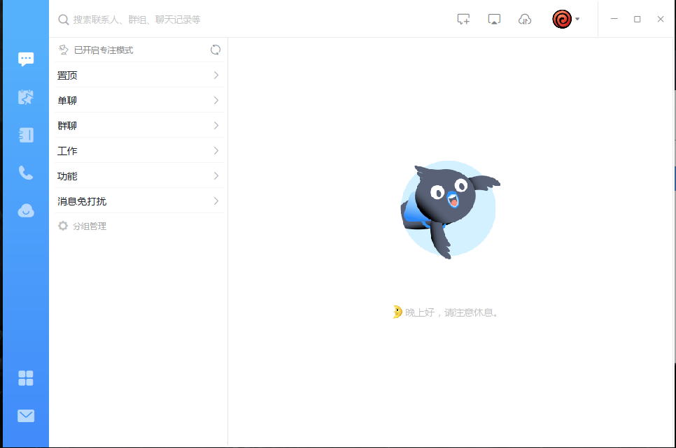
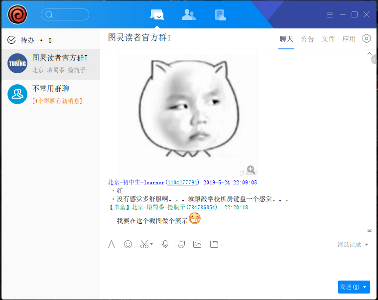

# PlayOnLinux 里的国产应用

一直在用 `debian sid `，因为工作需要鼓捣了一下 `企业微信` 的 wine，发现常用的 `app` 在 `PlayOnLinux` 中都基本完美。抽空打包分享一下。


## 应用简介

- ### 微信

  - 视频对方看不到你，本地摄像头无效，其他基本完美。

  

- ### 企业微信

  - 摄像头不能用，同微信，略有卡顿。

  

- ### 网易云音乐

  - 完美！ Linux 版的 tray icon 太大看着丑，而且 Win 版真！的！很！好！用！

  

- ### 钉钉

  - 基本功能没问题，用的少，不确定 bug 情况。摄像头肯定不能用。

  

- ### TIM

  - 摄像头还是一定不能用的。其他基本完美吧。

  


## 食用方法

1. 首先，要有PlayOnLinux

   ```
   # debian 系，其他发行版自己装吧。
   sudo dpkg --add-architecture i386 && sudo apt update
   sudo apt install playonlinux -y
   ```

2. 下载包 

   到项目的 [releases](https://github.com/jing2uo/apps-in-PlayOnLinux/releases) 页面下包。

3. 导入到PlayOnLinux

   PlayOnLinux 菜单栏 『插件』 —>  PlayOnLinux Vault —> Restore an applications —> 选择 *.polApp文件

   Done！

4. 如第一次打开有问题，请尝试：

   PlayOnLinux 工具栏 『配置』 —> 左侧选中应用 —> Wine 标签—> 修复虚拟盘

5.  有其他问题，欢迎来 issue ~

## 优点是啥？

- Linux 里也能聊天啊，尤其是企业微信和钉钉，不用也得用的工作群聊。
- 不需要为了它们去换deepin 或者 archlinux，你喜欢哪个发行版都会有 POL的。
- 不折腾，下载了导入就成，我也依赖它们，出问题会发现的。
- PlayOnLinux 简单易用，修改配置很方便，隔离好。

## 缺点是啥？

- 自用的，不官方也不权威。
- 文件大，压不小。
- 多少还是有点点小毛病的。

## 怎么做的？

- 有自己做的，比如微信，企业微信，钉钉和网易云
- TIM 从 arch 那边打的 deepin 打的包里扣下来改的（有点绕哈哈哈

## 安全嘛？

不会被盗号不会被偷钱不会被监听没有木马和插件等等你能想到的类似东东。

因为我，不！会！弄～

